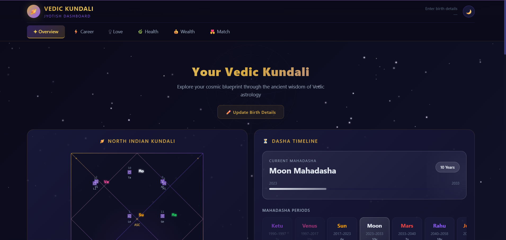
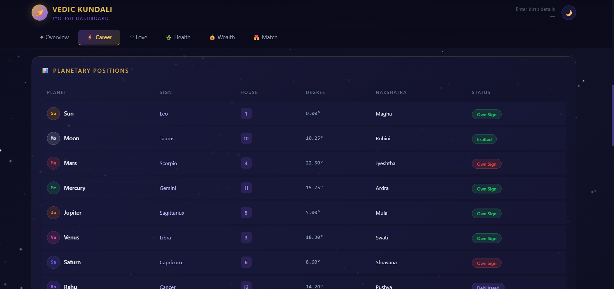
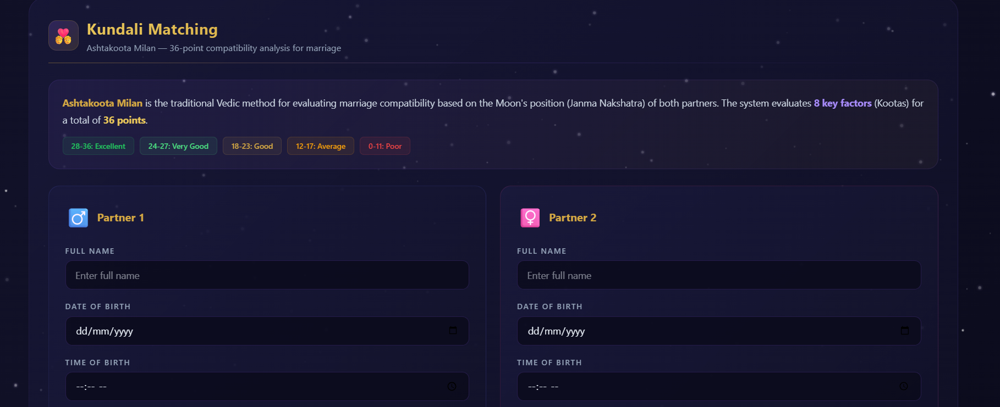

#  Vedic Kundali Dashboard

A modern Jyotish (Vedic astrology) dashboard built with React + Vite that provides an interactive view of a user's Kundali, planetary positions, and Mahadasha timeline.

---

##  Overview

This project visualizes an individual's astrological data in a clean, dark-themed interface inspired by cosmic design. It focuses on clarity, usability, and structured presentation of traditional Vedic astrology concepts.

---

##   Key Features

###  Kundali Visualization

* North Indian style Kundali chart
* Planetary placements (Sun, Moon, Mars, Venus, etc.)
* Ascendant (Lagna) positioning

###  Dasha Timeline

* Displays current **Mahadasha**
* Timeline progress bar (e.g., Moon Mahadasha: 2023–2033)
* Historical and upcoming planetary periods:

  * Ketu
  * Venus
  * Sun
  * Moon
  * Mars
  * Rahu
  * Jupiter (if extended)

###  User Profile Section

* Displays user name and location
* Option to update birth details dynamically

###  Dashboard Sections

* Overview (default landing)
* Career insights
* Love & relationships
* Health indicators
* Wealth analysis
* Match compatibility (UI ready)

---

##  Screenshots

###  Dashboard Overview



### Planetary



### Kundali_Matching


---

##  Tech Stack

* **React** – UI development
* **Vite** – Fast build tool
* **JavaScript (ES6+)**
* **CSS (Custom styling / Tailwind if used)**

---

##  Project Structure

```
src/
 ├── components/     → Reusable UI components
 ├── pages/          → Dashboard sections (Overview, Career, etc.)
 ├── assets/         → Icons, images
 └── main.jsx        → App entry point

public/              → Static files
index.html           → Root HTML
```

---

##  Installation & Setup

Clone the repository and run locally:

```bash
git clone https://github.com/your-username/vedic-kundali.git
cd vedic-kundali
npm install
npm run dev
```

Then open:

```
http://localhost:5173/
```

---

##  Implementation Notes

* The Kundali chart layout is manually structured using grid positioning.
* Dasha timeline is rendered dynamically based on predefined planetary sequences.
* UI is designed with a dark cosmic theme to enhance readability and aesthetics.
* Component structure is modular to allow easy expansion (e.g., API integration later).

---

##  Challenges Faced

* Structuring the North Indian Kundali layout correctly
* Managing UI alignment for planetary placements
* Designing a clean timeline visualization for Mahadasha periods

---

##  Learnings

* Improved understanding of component-based architecture in React
* Handling complex UI layouts without external chart libraries
* Creating visually rich dashboards with minimal dependencies

---

##  Future Improvements

* Integrate real astrology API for accurate calculations
* Add authentication system for multiple users
* Improve mobile responsiveness
* Add detailed interpretations for each section (career, health, etc.)

---

